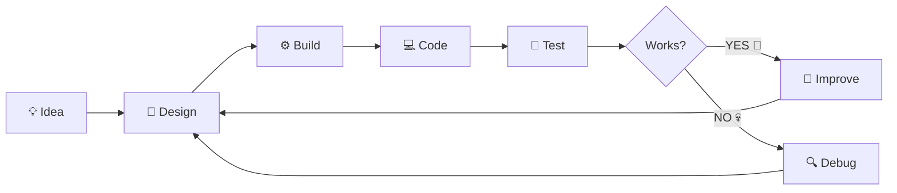
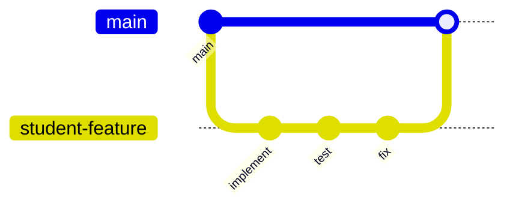
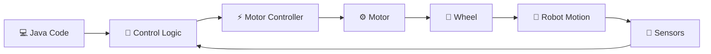

<div align="center">

# 🤖 EduRobotics – UoC
## FIRST Tech Challenge Lab

<div align="center">


</div>


<br>

*"The robot did exactly what you told it to do.*  
*Unfortunately, that wasn't what you wanted it to do."*

</div>

---

# 👋 Welcome!

Καλώς ήρθατε στο **EduRobotics – UoC FTC Lab repository**!

Το repository δημιουργήθηκε για εκπαιδευτικούς σκοπούς στο πλαίσιο της **EduRobotics – University of Crete** και περιλαμβάνει υλικό για την προετοιμασία μας στο **FIRST Tech Challenge**, καθώς και για τα εργαστήρια ρομποτικής της ομάδας.

Εδώ θα βρείτε:

-  Υλικό εργαστηρίων
-  Ασκήσεις
-  Παραδοτέα ασκήσεων
-  Hardware design
-  Software design
-  Κώδικα του robot
-  Πειράματα
-  Challenges
-  Εναν στατιστικά πολύ μεγάλο αριθμό από bugs

Στόχος μας είναι να κατασκευάσουμε ένα ρομπότ που καταλαβαίνουμε ακριβώς **πως και γιατί** λειτουγρεί. 

---

# 🗺️ Repository Map

```text
FTC-Lab/
│
├── 📁 labs/
│   └── Οδηγίες εργαστηρίων, θεωρία & πειράματα
│
├── 📁 exercises/
│   └── Ασκήσεις και challenges
│
├── 📁 submissions/
│   └── Λύσεις μαθητών
│
├── 📁 hardware/
│   ├── drivetrain/
│   ├── mechanisms/
│   └── design/
│
├── 📁 software/
│   ├── architecture/
│   └── design/
│
├── 📁 src/
│   └── Robot code 🤖
│
├── CONTRIBUTING.md
│
└── README.md
    └── 👈 You are here.
```

---

# 🎯 The Mission

Στα εργαστήρια θέλουμε να κατανοήσουμε **το  engineering process**:



Ο στόχος είναι κάποια στιγμή να μπορούμε να κοιτάξουμε το robot και να σκεφτούμε ότι καταλαβαίνουμε
γιατί κινείται αυτό το πράγμα. 

# 🧠 The Engineering Loop™

Κάθε πείραμα θα πρέπει, σε γενικές γραμμές, να ακολουθεί αυτή τη διαδικασία:

```text
┌─────────────────┐
│  1. UNDERSTAND  │
└────────┬────────┘
         ↓
┌─────────────────┐
│   2. PREDICT    │
└────────┬────────┘
         ↓
┌─────────────────┐
│    3. DESIGN    │
└────────┬────────┘
         ↓
┌─────────────────┐
│    4. TEST      │
└────────┬────────┘
         ↓
┌─────────────────┐
│   5. OBSERVE    │
└────────┬────────┘
         ↓
┌─────────────────┐
│    6. DEBUG     │
└────────┬────────┘
         │
         └───────────↻
```

Ή, για τους πιο προχωρημένους:

```java
while (!robotWorks()) {

    think();

    hypothesis = createHypothesis();

    test(hypothesis);

    observe();

    debug();
}

celebrate();

// TODO: figure out why it suddenly stopped working
```

---

# 📜 The Sacred Rules of the Lab

##  Rule #1 - Καταλαβαίνουμε πριν αντιγράψουμε

Μπορείτε να χρησιμοποιείτε:

-  Documentation *(recommended)*
-  Το Internet *(με την επίβλεψη των mentors, recommended)*
-  AI tools *(με την επίβλεψη των mentors, NOT recommended)*
-  Τους teammates σας *(recommended)*
-  Τους mentors *(recommended)*
-  Example code *(recommended)*

Υπάρχει όμως **ένας βασικός όρος**:

### Αν παραδίδετε κώδικα, πρέπει να μπορείτε να εξηγήσετε τι κάνει.

Αν ένας mentor σας ρωτήσει "Γιατί υπάρχει αυτή η γραμμή κώδικα εδώ?"

αυτή είναι μια απολύτως αποδεκτή απάντηση:

"Μετατρέπει τα ticks του encoder σε περιστροφές του τροχού"

Καπως λιγότερο αποδεκτή είναι η "Δεν ξέρω"

Και αυτή...

> "Το έγραψε το AI"

...σημαίνει ότι θα καθίσουμε μαζί για να καταλάβουμε τι ακριβώς κάνει.

---

## Rule #2 - Random changes ≠ debugging

Αυτό:

```text
change number
↓
run
↓
change another number
↓
run
↓
change 4 things
↓
run
↓
pray
↓
????
↓
robot works
```

**δεν είναι debugging**.

Δοκιμάστε αυτό:

```text
OBSERVATION
     ↓
HYPOTHESIS
     ↓
EXPERIMENT
     ↓
RESULT
     ↓
CONCLUSION
```

Σε γενικές γραμμές προσπαθούμε να αλλάζουμε αποκλριστικά ένα πράγματα τη φορά. 
Διαφορετικά, ακόμη κι αν το robot αρχίσει ξαφνικά να λειτουργεί...
**δεν θα ξέρετε γιατί.**
Και, ακόμα σημαντικότερα, δεν θα ξέρετε πώς να διορθώσετε ένα αντίστοιχο πρόβλημα στο μέλλον.

---

## Rule #3 - ROBOT MOVING! 🚨

Πριν εκτελέσετε κώδικα που πρόκειται να κινήσει οποιοδήποτε μέρος του robot:

# 🗣️ Ενημερώστε τους συμμαθητές και τους μέντορες σας

> ## "Το ξεκινάω!"

Όλοι γύρω από το robot πρέπει να γνωρίζουν ότι κάτι πρόκειται να κινηθεί, να πεταχτεί. 
ΠΑΝΤΑ στο εργαστήριο όταν ασχολούμαστε με το Hardware φοράμε προστατευτικό εξοπλισμό.

Πριν πατήσετε **PLAY**, πρέπει να ισχύουν τα ακόλουθα:

```text
[ ] Κανείς δεν έχει τα χέρια του μέσα στο robot
[ ] Το robot έχει αρκετό χώρο για να κινηθεί
[ ] Τα καλώδια είναι μακριά από κινούμενα μέρη ή καλά προσταυεμένα
[ ] Δεν υπάρχουν εργαλεία μέσα στο robot
[ ] Ο μηχανισμός μπορεί να κινηθεί με ασφάλεια
[ ] Το emergency stop είναι προσβάσιμο
[ ] Έχουμε ήδη προβλέψει το αποτέλεσμα του κώδικα
```


---

## Rule #4 - Respect the hardware

Το hardware δυστυχώς **δεν προστατεύεται από Ctrl+Z**.

Μην:

- ❌ πιέζετε μηχανισμούς με το χέρι
- ❌ τραβάτε connectors από τα καλώδιά τους
- ❌ αφήνετε βίδες ή εργαλεία μέσα στο robot
- ❌ αφήνετε stalled motors (κινητήρες που εμποδίζονται από κάτι) να λειτουργούν συνεχόμενα
- ❌ αλλάζετε καλωδίωση ενώ το robot είναι ενεργοποιημένο
- ❌ βάζετε τα δάχτυλά σας μέσα σε κινούμενους μηχανισμούς
- ❌ χρησιμοποιείτε το robot ως μέσο μεταφοράς
- ❌ προσπαθείτε να ανακαλύψετε αν το drivetrain μπορεί να σκαρφαλώσει τοίχους

Το τελευταίο είναι συζητήσιμο.

**Ρωτήστε τους εθελοντές μας**

> ⚠️ **Safety Notice:** Αν ο Στέφανος ή ο Σούσης πουν ναι, αγνοήστε τους. Θα έλεγαν ναι. 

---

## Rule #5 - ASK QUESTIONS.

Οι ερωτήσεις είναι μέρος του engineering.

Καλές ερωτήσεις είναι:

> "Γιατί λειτουργεί αυτό?"

> "Γιατί σχεδιάσαμε έτσι αυτό?"

> "Τι γίνεται αν αλλάξουμε αυτό?"

> "Στον φυσικό κόσμο ή στην διαίσθηση τι ακριβώς είναι αυτή η μεταβλητή"

> "Γιατί είναι τα motors mirrored?"

> "WΓιατί το ρομπότ μας κάνει... ΑΥΤΟ?"

> "ΔΕΝ ΚΑΤΑΛΑΒΑΙΝΩ"

Η τελευταία είναι ιδιαίτερα σημαντική, καθώς είστε εδώ για να μάθετε. 

Συνεπώς, κανείς δεν περιμένει να γνωρίζετε ήδη τα πάντα.

---

## Rule #6 - Help. Don't hijack.

Αν ένας συμμαθητής σας έχει κολλήσει, μην του πάρετε το πληκτρολόγιο ή το κατσαβίδι. 
Προσπαθήστε να του εξηγήσετε. 
"Τι τιμή περιμένεις να έχει αυτή η μεταβλητή?". Προσπαθείστε να τον κατευθύνετε να καταλάβει. 
Στο μέλλον σίγουρα θα χρειαστεί να κάνει το ίδιο αυτός για εσάς. 


# 💾 Rule #7 - COMMIT. YOUR. CODE.

Please.

**Please.**

# PLEASE.

Το Git υπάρχει για κάποιο λόγο.

```bash
git add .
git commit -m "Implement field-centric drivetrain control"
git push
```

Good commit messages:

```text
Add mecanum wheel calculations

Implement encoder reset

Fix reversed right motor direction

Add autonomous movement test

Refactor drivetrain initialization
```

Cursed commit messages:

```text
update

stuff

changes

test

aaa

idk

work pls

PLEASE WORK

final

final2

final_final

FINAL_REAL

FINAL_REAL_THIS_TIME
```

😭

---

# 🌿 Git Workflow

Για τις ασκήσεις και τις μεγαλύτερες αλλαγές χρησιμοποιούμε **branches**.



Ένα τυπικό workflow είναι:

```bash
# Get the latest version
git pull

# Create your branch
git checkout -b your-name/exercise-name

# Work...

git add .

git commit -m "Implement motor velocity control"

git push -u origin your-name/exercise-name
```

Στη συνέχεια ανοίγετε ένα **Pull Request**.

---

# 📝 Exercise Submissions

Οι ασκήσεις πρέπει να παραδίδονται μέσα στο:

```text
submissions/
```

Προτεινόμενη δομή:

```text
submissions/
└── student-name/
    ├── lab-01/
    │   ├── README.md
    │   └── src/
    │
    ├── lab-02/
    │   ├── README.md
    │   └── src/
    │
    └── ...
```

Κάθε submission θα πρέπει να περιλαμβάνει ένα μικρό `README.md` που απαντά:

```markdown
## Τι υλοποίησες;

...

## Τι περίμενες να συμβεί;

...

## Τι συνέβη στην πραγματικότητα;

...

## Τι προβλήματα αντιμετώπισες;

...

## Πώς τα έλυσες;

...

## Τι έμαθες;

...
```

Δεν μας ενδιαφέρει μόνο η τελική λύση.

### Θέλουμε να δούμε και τον τρόπο σκέψης.

---

# The Debugging Protocol

Το robot δεν λειτουργεί. Πριν καλέσετε έναν mentor:

### Step 1 - Read the error.
Διαβάστε προσεκτικά τι συμβαίνει λάθος στο ρομποτ σας. 
Στην αρχή είναι λίγο τρομακτικό μετά είναι απλή συνήθεια. 

### Step 2 - Βρείτε που είναι το πρόβλημα

Προσπαθήστε να εντοπίσετε πού βρίσκεται το πρόβλημα:

- software;
- hardware;
- configuration;
- wiring;
- communication;
- mechanical;
- physics reminding us who's actually in charge?

###  Step 3 - Υποθέστε

Πιστεύετε ότι η παρακάτω γραμμή κώδικα θα πάει μπροστά το ρομποτ. 

```java
leftMotor.setPower(1);
```

Αλλά η πραγματικότητα μπορεί να είναι 

```text
robot ↻ VIOLENT ROTATION
```

### Step 4 - Δείτε τι ακριβώς συμβαίνει.

Χρησιμοποιήστε:

- telemetry
- logs
- encoder values
- sensor readings
- motor velocities
- timing measurements
- your eyes

### Step 5 - Απομονώστε το πρόβλημα

Μην προσπαθήσετε να κάνετε debug ολόκληρο το πρόγραμμα. 
Ένα πρόβλημα τη φορά. 

#  Mentor Summoning Protocol

Πριν βγάλετε το συμπέρασμα ότι κάτι δεν δουλεύει και επικοινωνήσετε 
με τους μέντορες σας, προσπαθήστε να έχετε απάντηση στα παρακάτω:

```text
┌──────────────────────────────────────────────┐
│ 1. Τι περίμενα να συμβεί;                   │
│                                              │
│ 2. Τι συνέβη στην πραγματικότητα;           │
│                                              │
│ 3. Πού πιστεύω ότι βρίσκεται το πρόβλημα;   │
│                                              │
│ 4. Τι έχω ήδη ελέγξει;                      │
│                                              │
│ 5. Τι μου έδειξαν αυτοί οι έλεγχοι;         │
└──────────────────────────────────────────────┘
```

Μετά, ενοχλήστε μας :)

```text
              🧙
             /|\
              |
             / \
        THE MENTOR

   "show me the error"
```

Το mentor happiness αυξάνεται δραματικά όταν λέτε:

**"Περίμενα X, αλλά συνέβη Y. Έλεγξα τα A και B, οπότε πιστεύω ότι το πρόβλημα μπορεί να είναι το C."**
αντί για:
**"Δεν δουλεύει"**

---

#  Challenge System

Ορισμένα labs περιλαμβάνουν προαιρετικά challenges.

Γιατί έτσι :)

##  Level 1 — Apprentice

Ολοκλήρωσε τον βασικό στόχο.

**Reward:** The robot does something.

---

##  Level 2 — Engineer

Βελτίωσε τη βασική λύση.

**Reward:** The robot does something *well*.

---

##  Level 3 — Wizard

Δημιούργησε μια πιο καθαρή, έξυπνη ή γενικευμένη λύση.

**Reward:** Respect.

---

##  Level 4 — WHY WOULD YOU DO THIS?

Ένα παραλογα δύσκολο challenge:

**Reward:**

```text
+100 imaginary engineering points

+1 mentor nod of approval

+1 mysterious achievement

+0 ECTS
```

---

#  Achievements

Unofficial achievements may include:

| Achievement | Requirement |
|---|---|
| 🐣 **Hello Robot** | Κάνε ένα motor να κινηθεί για πρώτη φορά |
| 🔥 **Magic Smoke Survivor** | Παραλίγο να σπάσεις κάτι, αλλά τελικά δεν το έσπασες |
| 🐛 **Bug Hunter** | Βρες ένα bug που δεν είχε παρατηρήσει κανείς άλλος |
| 🧙 **Debugger** | Διόρθωσε ένα πρόβλημα χωρίς παρέμβαση mentor |
| 📖 **RTFM** | Λύσε ένα πρόβλημα διαβάζοντας όντως το documentation |
| 🌿 **Git Wizard** | Λύσε το πρώτο σου merge conflict |
| 💀 **Detached HEAD** | Discover Git's forbidden dimension |
| 📐 **Engineer** | Measure before guessing |
| 🤖 **Robot Whisperer** | Διάγνωσε hardware πρόβλημα μόνο από τον ήχο |
| 🧠 **Wait... I Get It!** | Εξήγησε κάτι που δεν καταλάβαινες την προηγούμενη εβδομάδα |
| 🔴 **WHY WOULD YOU DO THIS?** | Complete a Level 4 challenge |

Τα achievements δεν έχουν **καμία απολύτως ακαδημαϊκή αξία** και για αυτό είανι τα σημαντικότερα

---

# 🤖 Hardware + Software

Μία από τις σημαντικότερες ιδέες αυτού του repository είναι ότι:

### Software does not exist in isolation.

Όταν γράφουμε:

```java
motor.setVelocity(1200);
```

το `1200` αντιστοιχεί σε ένα πραγματικό μεγεθος που κάπως θα αντικατοπτριστεί στον πραγματικό κόσμο


Στα labs θα κινούμαστε συνεχώς ανάμεσα σε:

```text
CODE
 ↕
MATH
 ↕
HARDWARE
 ↕
PHYSICS
```

Η κατανόηση αυτών των συνδέσεων είναι ένας από τους βασικούς στόχους του εργαστηρίου.

---

# Experiments > Guessing

Ας υποθέσουμε ότι δεν γνωρίζουμε ποια είναι η καλύτερη ταχύτητα ενός motor.

Θα μπορούσαμε να κάνουμε:

```text
guess → 1000
guess → 1200
guess → 1500
guess → 1700
```

Ή

θα μπορούσαμε να συμπεριφερθούμε ύποπτα σαν engineers:

| Test | Velocity | Time | Error |
|---|---:|---:|---:|
| 1 | 1000 | ... | ... |
| 2 | 1200 | ... | ... |
| 3 | 1400 | ... | ... |
| 4 | 1600 | ... | ... |

και μετά να αναλύσουμε τα αποτελέσματα.

### Measure first. Decide second.

---

# Things That Require a Mentor

Ρωτήστε έναν mentor **πριν**:

- ⚠️ αλλάξετε σημαντικά την ηλεκτρική καλωδίωση
- ⚠️ δοκιμάσετε έναν άγνωστο μηχανισμό υψηλής ταχύτητας
- ⚠️ τροποποιήσετε safety-critical hardware
- ⚠️ αλλάξετε/flashing σημαντικό device firmware
- ⚠️ κάνετε δομικές αλλαγές στο robot
- ⚠️ δοκιμάσετε κάτι που μπορεί να προκαλέσει ζημιά στο hardware
- ⚠️ κάνετε οτιδήποτε σας κάνει να σκεφτείτε:

> "This is probably fine."

Especially the last one.

---

# 📚 Lab Philosophy

<details>
<summary><b>🧠 Click here for the secret philosophy of the lab</b></summary>

<br>

Δεν περιμένουμε να γνωρίζετε ήδη robotics.

Δεν περιμένουμε να γνωρίζετε κάθε algorithm.

Δεν περιμένουμε να καταλαβαίνετε αμέσως κάθε κομμάτι του hardware.

**Περιμένουμε**, όμως, να:

- είστε περίεργοι,
- πειραματίζεστε,
- κάνετε ερωτήσεις,
- βοηθάτε ο ένας τον άλλον,
- καταγράφετε όσα μαθαίνετε,
- σκέφτεστε πριν αρχίσετε να αλλάζετε πράγματα στην τύχη,
- και σταδιακά να γίνεστε περισσότερο ανεξάρτητοι.

Ο στόχος **δεν είναι**:

> **"The mentor knows how to fix the robot."**

Ο στόχος είναι:

> **"The team knows how to figure out how to fix the robot."**

</details>

---

# ❓ FAQ

<details>
<summary><b>🤖 The robot isn't moving. What do I do?</b></summary>

<br>

Excellent.

Ξεκινήστε με το debugging protocol.

Ελέγξτε:

1. Είναι ενεργοποιημένο το robot;
2. Εκτελείται όντως το πρόγραμμα;
3. Έχουν γίνει σωστά initialize τα motors;
4. Στέλνετε power/velocity στα motors;
5. Δείχνει το telemetry αυτό που περιμένετε;
6. Υπάρχει hardware πρόβλημα;

**Μην ξαναγράψετε αμέσως ολόκληρο το πρόγραμμα.**

</details>

<details>
<summary><b>💻 Can I use ChatGPT / AI?</b></summary>

<br>

Ναι, εκτός αν μια άσκηση αναφέρει ρητά το αντίθετο.

Πρέπει όμως να **καταλαβαίνετε αυτό που παραδίδετε**.

Το AI μπορεί να σας βοηθήσει να **μάθετε** τη λύση.

Δεν πρέπει να αντικαταστήσει τη διαδικασία μάθησης.

</details>

<details>
<summary><b>🧙 When should I ask a mentor?</b></summary>

<br>

Όποτε πραγματικά χρειάζεστε βοήθεια.

**Δεν χρειάζεται να μείνετε κολλημένοι για μία ώρα** απλώς και μόνο για να αποδείξετε ότι προσπαθήσατε.

Προσπαθήστε πρώτα να προσδιορίσετε:

- τι περιμένατε να συμβεί,
- τι συνέβη,
- τι έχετε ήδη ελέγξει.

Then ask.

</details>

<details>
<summary><b>💥 I broke something. Am I in trouble?</b></summary>

<br>

Probably not.

Robots break.

Ενημερώστε έναν mentor.

Το να προσπαθήσετε να κρύψετε ένα πρόβλημα είναι πολύ χειρότερο από το να προκαλέσετε ένα πρόβλημα κατά τη διάρκεια ενός πραγματικού πειράματος.

</details>

<details>
<summary><b>🌿 I created a merge conflict.</b></summary>

<br>

Congratulations.

You have unlocked:

### 💀 Git.

Ζητήστε βοήθεια αν δεν καταλαβαίνετε τι ακριβώς σας ζητάει το Git να κάνετε merge.

**Μην διαγράφετε τυχαία conflict markers ελπίζοντας ότι όλα θα πάνε καλά.**

</details>

---

# 🎓 Academic & Team Integrity

Σας ενθαρρύνουμε να:

- ✅ συζητάτε ιδέες
- ✅ συνεργάζεστε
- ✅ διαβάζετε documentation
- ✅ αναζητάτε λύσεις
- ✅ ρωτάτε mentors
- ✅ χρησιμοποιείτε υπεύθυνα AI
- ✅ πειραματίζεστε
- ✅ μαθαίνετε από υπάρχοντα code

Δεν πρέπει να:

- ❌ παραδίδετε τη δουλειά κάποιου άλλου ως δική σας
- ❌ αντιγράφετε code που δεν καταλαβαίνετε
- ❌ αποκρύπτετε από πού προήλθε μια λύση
- ❌ αφήνετε έναν teammate να κάνει όλη τη δουλειά
- ❌ αλλοιώνετε αποτελέσματα για να φαίνεται ότι ένα πείραμα "δούλεψε"

Η σημαντική ερώτηση είναι:

# **"Do you understand the engineering behind what you submitted?"**

---

# 🌟 The Most Important Rule

Robotics is supposed to be **fun**.

Μπορείτε να πειραματίζεστε.

Μπορείτε να κάνετε λάθη.

Μπορείτε να κάνετε "χαζές" ερωτήσεις.

Μπορείτε να προτείνετε περίεργες ιδέες.

Μπορείτε να κατασκευάσετε κάτι που θα αποτύχει θεαματικά.

Μπορείτε ακόμη και να γράψετε κώδικα που κάνει το robot:

```text
                    🤖
                     \
                      \
                       \
                        \

                    why
```

Απλώς φροντίστε στο τέλος να καταλάβουμε:

# WHY.

---

<div align="center">

# 🤖 Welcome to the Lab.

### Now go make the robot do something stupid.

*...preferably intentionally.*

<br>

### `BUILD → BREAK → DEBUG → LEARN → REPEAT`

<br>

<div align="center">


</div>

**EduRobotics – University of Crete**

*FIRST Tech Challenge Educational Repository*

</div>
````

