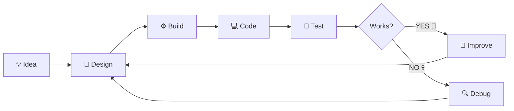
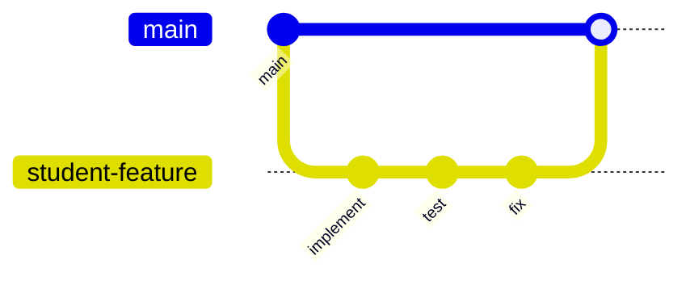
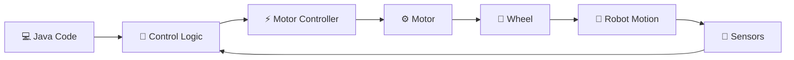

<div align="center">

# 🤖 EduRobotics – UoC
## FIRST Tech Challenge Lab

### <div align="center">


</div>


<br>

*"The robot did exactly what you told it to do.*  
*Unfortunately, that wasn't what you wanted it to do."*

</div>

---

# 👋 Welcome, Humans!

Welcome to the **EduRobotics - UoC FTC Lab repository**!

This repository exists for educational purposes on behalf of **EduRobotics – University of Crete** and contains material used for our **FIRST Tech Challenge preparation and robotics labs**.

Here you will find:

- 📚 Lab material
- 🧩 Exercises
- 📝 Exercise submissions
- ⚙️ Hardware design
- 💻 Software design
- 🤖 Robot software
- 🧪 Experiments
- 🏆 Challenges
- 🐛 A statistically significant number of bugs

Our objective is **not** simply to build a robot that works.

We want to understand:

 **WHY it works.**

---

# 🗺️ Repository Map

```text
FTC-Lab/
│
├── 📁 labs/
│   └── Lab instructions, theory & experiments
│
├── 📁 exercises/
│   └── Exercises and challenges
│
├── 📁 submissions/
│   └── Student solutions
│
├── 📁 hardware/
│   ├── drivetrain/
│   ├── mechanisms/
│   └── design/
│
├── 📁 software/
│   ├── architecture/
│   └── design/
│
├── 📁 src/
│   └── Robot code 🤖
│
├── CONTRIBUTING.md
│
└── README.md
    └── 👈 You are here.
```

---

# 🎯 The Mission

During the labs we want to understand the complete engineering process:



The goal is to eventually look at the robot and think:
**"I understand why this thing moves."**

---

# 🧠 The Engineering Loop™

Every experiment should roughly follow this process:

```text
┌─────────────────┐
│  1. UNDERSTAND  │
└────────┬────────┘
         ↓
┌─────────────────┐
│   2. PREDICT    │
└────────┬────────┘
         ↓
┌─────────────────┐
│    3. DESIGN    │
└────────┬────────┘
         ↓
┌─────────────────┐
│    4. TEST      │
└────────┬────────┘
         ↓
┌─────────────────┐
│   5. OBSERVE    │
└────────┬────────┘
         ↓
┌─────────────────┐
│    6. DEBUG     │
└────────┬────────┘
         │
         └───────────↻
```

Or, for the programmers:

```java
while (!robotWorks()) {

    think();

    hypothesis = createHypothesis();

    test(hypothesis);

    observe();

    debug();
}

celebrate();

// TODO: figure out why it suddenly stopped working
```

---

# 📜 The Sacred Rules of the Lab

## 🥇 Rule #1 - Understand before you copy

You are absolutely allowed to use:

- 📖 Documentation (recommended)
- 🌐 The Internet (under mentors' supervision, recommended)
- 🤖 AI tools (under mentors' supervision, NOT recommended)
- 👥 Your teammates (recommended)
- 🧙 Mentors (recommended)
- 💻 Example code (recommended)

But there is one condition:

### If you submit code, you must be able to explain it.

If a mentor asks:

> **"Why is this line here?"**

this is a perfectly acceptable answer:

> "It converts the encoder ticks into wheel rotations."

This is somewhat less acceptable:

> "I don't know."

And this...

> "ChatGPT wrote it 💀"

...means we're going to sit down and understand it together. 

---

## 🥈 Rule #2 - Random changes ≠ debugging

This:

```text
change number
↓
run
↓
change another number
↓
run
↓
change 4 things
↓
run
↓
pray
↓
????
↓
robot works
```

is **not debugging**.

Try this instead:

```text
OBSERVATION
     ↓
HYPOTHESIS
     ↓
EXPERIMENT
     ↓
RESULT
     ↓
CONCLUSION
```

Whenever possible:

### Change ONE thing at a time.

Otherwise, even if the robot starts working...

**you won't know why.** and you will not be albe to fix future problems

---

## 🥉 Rule #3 - ROBOT MOVING! 🚨

Before running code that moves hardware:

# 🗣️ SAY IT.

> ## "ROBOT MOVING!"

Everyone around the robot should know that something is about to happen.

Before pressing **PLAY**:

```text
[ ] Nobody has their hands inside the robot
[ ] The robot has enough space
[ ] Cables are clear
[ ] Tools are not inside the robot
[ ] The mechanism can move safely
[ ] Emergency stop is accessible
[ ] The code looks vaguely sane
```

Especially if your code contains:

```java
motor.setPower(1.0);
```

👀

---

## 🔧 Rule #4 - Respect the hardware

Hardware is unfortunately **not protected by Ctrl+Z**.

Do not:

- ❌ force mechanisms by hand
- ❌ pull connectors by their wires
- ❌ leave screws inside the robot
- ❌ run stalled motors continuously
- ❌ change wiring while the robot is powered
- ❌ put fingers inside moving mechanisms
- ❌ use the robot as transportation
- ❌ attempt to discover whether the drivetrain can climb walls

That last one is negotiable.

**Ask a mentor first.**
 ⚠️ **Safety Notice:** Approval from Sousis or Stefanos does not constitute mentor approval. They would have said yes.

---

## 🧠 Rule #5 — ASK QUESTIONS.

Questions are not interruptions.

Questions are part of engineering.

Good questions include:

 "Why does this happen?"

"Why did we design it like this?"
"What happens if we change this?"
"What does this variable physically represent?"
"Why are the motors mirrored?"
"Why is the robot doing THAT?"
"I don't understand this."

The last one is especially important.

### You are here to learn.

Nobody expects you to already know everything.

---

## 🤝 Rule #6 — Help. Don't hijack.

If your teammate is stuck:

### ❌ Don't do this

> "Give me the keyboard."

### ✅ Try this

> "What do you expect this variable to contain?"

or

> "Where do you think the problem starts?"

or

> "How could we test that?"

or

> "Let's print that value and see."

The goal isn't for **the code** to learn.

The goal is for **the humans** to learn.

---

# 💾 Rule #7 — COMMIT. YOUR. CODE.

Please.

**Please.**

# PLEASE.

Git exists for a reason.

```bash
git add .
git commit -m "Implement field-centric drivetrain control"
git push
```

Good commit messages:

```text
Add mecanum wheel calculations

Implement encoder reset

Fix reversed right motor direction

Add autonomous movement test

Refactor drivetrain initialization
```

Cursed commit messages:

```text
update

stuff

changes

test

aaa

idk

work pls

PLEASE WORK

final

final2

final_final

FINAL_REAL

FINAL_REAL_THIS_TIME
```

😭

---

# 🌿 Git Workflow

For exercises and larger changes, we use branches.



A typical workflow:

```bash
# Get the latest version
git pull

# Create your branch
git checkout -b your-name/exercise-name

# Work...

git add .

git commit -m "Implement motor velocity control"

git push -u origin your-name/exercise-name
```

Then open a **Pull Request**.

---

# 📝 Exercise Submissions

Exercises should be submitted inside:

```text
submissions/
```

Recommended structure:

```text
submissions/
└── student-name/
    ├── lab-01/
    │   ├── README.md
    │   └── src/
    │
    ├── lab-02/
    │   ├── README.md
    │   └── src/
    │
    └── ...
```

Each submission should contain a small `README.md` answering:

```markdown
## What did you implement?

...

## What did you expect to happen?

...

## What actually happened?

...

## What problems did you encounter?

...

## How did you solve them?

...

## What did you learn?

...
```

The important part isn't just the final solution.

### We want to see the reasoning.

---

# 🐛 The Debugging Protocol

Your robot doesn't work.

Excellent.

Welcome to robotics.

Before summoning a mentor, try:

### 🔍 Step 1 — Read the error.

Yes.

The entire error.

We know.

It's horrifying.

Read it anyway.

### 🔍 Step 2 — Find WHERE the problem occurs.

Is it:

- software?
- hardware?
- configuration?
- wiring?
- communication?
- mechanical?
- physics reminding us who's actually in charge?

### 🔍 Step 3 — Check your assumptions.

You think:

```java
leftMotor.setPower(1);
```

means:

```text
robot → forward
```

But perhaps reality says:

```text
robot ↻ VIOLENT ROTATION
```

Interesting.

Why?

### 🔍 Step 4 — Measure something.

Use:

- telemetry
- logs
- encoder values
- sensor readings
- motor velocities
- timing measurements
- your eyes™

### 🔍 Step 5 — Isolate the problem.

Don't debug:

```text
THE ENTIRE ROBOT
```

Debug:

```text
motor 1
```

then:

```text
motor 2
```

then:

```text
drivetrain
```

then:

```text
robot
```

---

# 🧙 Mentor Summoning Protocol

Before saying:

> "It doesn't work."

try to answer these:

```text
┌───────────────────────────────────────────┐
│ 1. What did I expect to happen?          │
│                                           │
│ 2. What actually happened?               │
│                                           │
│ 3. Where do I think the problem is?       │
│                                           │
│ 4. What have I already tested?            │
│                                           │
│ 5. What did those tests tell me?          │
└───────────────────────────────────────────┘
```

Then you may summon:

```text
              🧙
             /|\
              |
             / \
        THE MENTOR

   "show me the error"
```

Mentor happiness increases dramatically when you say:

> **"I expected X, but Y happened. I tested A and B, so I think the problem might be C."**

instead of:

> **"broken."**

---

# 🏆 Challenge System

Some labs contain optional challenges.

Because apparently the normal exercises weren't enough.

## 🟢 Level 1 — Apprentice

Complete the basic objective.

**Reward:** The robot does something.

---

## 🔵 Level 2 — Engineer

Improve the basic solution.

**Reward:** The robot does something *well*.

---

## 🟣 Level 3 — Wizard

Create a cleaner, smarter, more general solution.

**Reward:** Respect.

---

## 🔴 Level 4 — WHY WOULD YOU DO THIS?

The unnecessarily difficult mentor challenge.

**Reward:**

```text
+100 imaginary engineering points

+1 mentor nod of approval

+1 mysterious achievement

+0 ECTS
```

---

# 🏅 Achievements

Unofficial achievements may include:

| Achievement | Requirement |
|---|---|
| 🐣 **Hello Robot** | Make a motor move for the first time |
| 🔥 **Magic Smoke Survivor** | Almost break something but don't |
| 🐛 **Bug Hunter** | Find a bug nobody else noticed |
| 🧙 **Debugger** | Fix a problem without mentor intervention |
| 📖 **RTFM** | Solve something by actually reading the documentation |
| 🌿 **Git Wizard** | Resolve your first merge conflict |
| 💀 **Detached HEAD** | Discover Git's forbidden dimension |
| 📐 **Engineer** | Measure before guessing |
| 🤖 **Robot Whisperer** | Diagnose a hardware problem from the sound |
| 🧠 **Wait... I Get It!** | Explain something you didn't understand last week |
| 🔴 **WHY WOULD YOU DO THIS?** | Complete a Level 4 challenge |

Achievements have absolutely no academic value.

This makes them extremely important.

---

# 🤖 Hardware + Software

One of the most important ideas in this repository:

### Software does not exist in isolation.

When we write:

```java
motor.setVelocity(1200);
```

`1200` isn't just a number.

It corresponds to something happening in the **physical world**.



We will constantly move between:

```text
CODE
 ↕
MATH
 ↕
HARDWARE
 ↕
PHYSICS
```

Understanding those connections is one of the main goals of the lab.

---

# 🧪 Experiments > Guessing

Suppose we don't know the best motor velocity.

We could:

```text
guess → 1000
guess → 1200
guess → 1500
guess → 1700
```

Or...

we could behave suspiciously like engineers:

| Test | Velocity | Time | Error |
|---|---:|---:|---:|
| 1 | 1000 | ... | ... |
| 2 | 1200 | ... | ... |
| 3 | 1400 | ... | ... |
| 4 | 1600 | ... | ... |

Then analyze the result.

### Measure first. Decide second.

---


# 🚨 Things That Require a Mentor

Ask before:

- ⚠️ changing major electrical wiring
- ⚠️ testing an unfamiliar high-speed mechanism
- ⚠️ modifying safety-critical hardware
- ⚠️ flashing/changing important device firmware
- ⚠️ making structural robot changes
- ⚠️ testing something that could damage hardware
- ⚠️ doing anything that makes you think:

> "This is probably fine."

Especially the last one.

---

# 📚 Lab Philosophy

<details>
<summary><b>🧠 Click here for the secret philosophy of the lab</b></summary>

<br>

We don't expect you to know robotics.

We don't expect you to know every algorithm.

We don't expect you to immediately understand every piece of hardware.

We **do** expect you to:

- be curious,
- experiment,
- ask questions,
- help each other,
- document what you learn,
- think before randomly changing things,
- and gradually become more independent.

The goal is not:

> **"The mentor knows how to fix the robot."**

The goal is:

> **"The team knows how to figure out how to fix the robot."**

</details>

---

# ❓ FAQ

<details>
<summary><b>🤖 The robot isn't moving. What do I do?</b></summary>

<br>

Excellent.

Start with the debugging protocol.

Check:

1. Is the robot powered?
2. Is the program actually running?
3. Are the motors initialized correctly?
4. Are you sending power/velocity?
5. Does telemetry show what you expect?
6. Is there a hardware problem?

Do **not** immediately rewrite the entire program.

</details>

<details>
<summary><b>💻 Can I use ChatGPT / AI?</b></summary>

<br>

Yes, unless an exercise explicitly says otherwise.

But you must understand what you submit.

AI can help you **learn** the solution.

AI should not replace the learning.

</details>

<details>
<summary><b>🧙 When should I ask a mentor?</b></summary>

<br>

Whenever you genuinely need help.

You do **not** need to waste an hour being stuck just to prove that you tried.

Try to identify:

- what you expected,
- what happened,
- what you've tested.

Then ask.

</details>

<details>
<summary><b>💥 I broke something. Am I in trouble?</b></summary>

<br>

Probably not.

Robots break.

Tell a mentor.

Trying to hide a problem is much worse than causing one while genuinely experimenting.

</details>

<details>
<summary><b>🌿 I created a merge conflict.</b></summary>

<br>

Congratulations.

You have unlocked:

### 💀 Git.

Ask for help if you don't understand what Git is asking you to merge.

Do **not** randomly delete conflict markers and hope for the best.

</details>

---

# 🎓 Academic & Team Integrity

You are encouraged to:

- ✅ discuss ideas
- ✅ work together
- ✅ read documentation
- ✅ search for solutions
- ✅ ask mentors
- ✅ use AI responsibly
- ✅ experiment
- ✅ learn from existing code

You should **not**:

- ❌ submit somebody else's work as your own
- ❌ copy code you don't understand
- ❌ hide where a solution came from
- ❌ let one teammate do all the work
- ❌ manipulate results to make an experiment "work"

The important question is:

 **"Do you understand the engineering behind what you submitted?"**

---

# 🌟 The Most Important Rule

Robotics is supposed to be **fun**.

You are allowed to experiment.

You are allowed to make mistakes.

You are allowed to ask "stupid" questions.

You are allowed to propose weird ideas.

You are allowed to build something that fails spectacularly.

You are even allowed to write code that makes the robot:

```text
                    🤖
                     \
                      \
                       \
                        \

                    why
```

Just make sure we eventually understand:

# WHY.

---

<div align="center">

# 🤖 Welcome to the Lab.

### Now go make the robot do something stupid.

*...preferably intentionally.*

<br>

### `BUILD → BREAK → DEBUG → LEARN → REPEAT`

<br>

<div align="center">


</div>
**EduRobotics – University of Crete**

*FIRST Tech Challenge Educational Repository*

</div>
